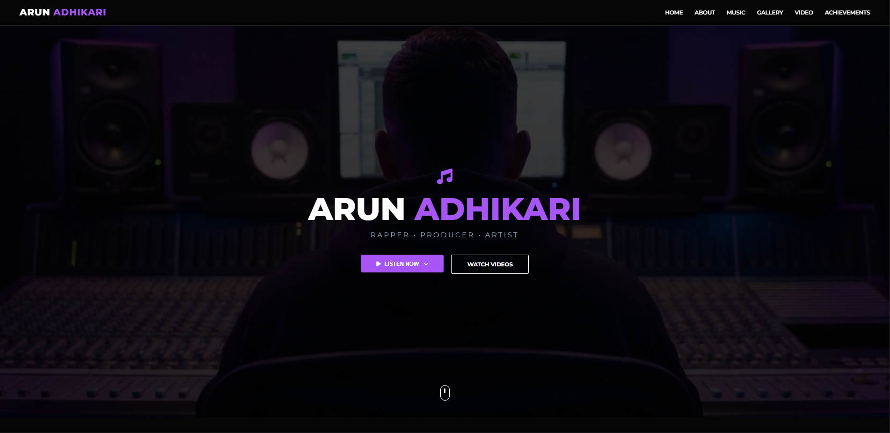
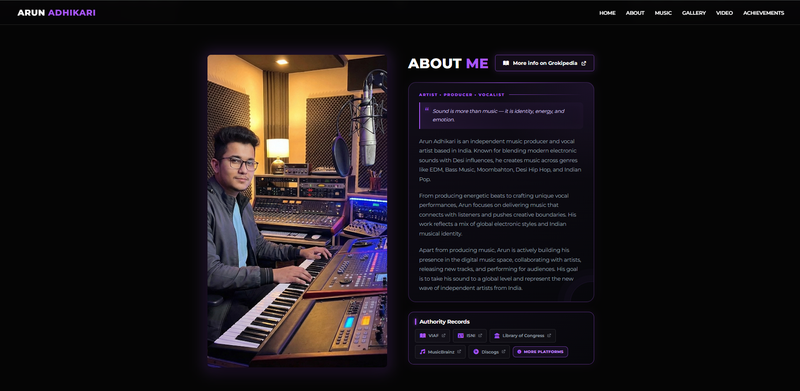
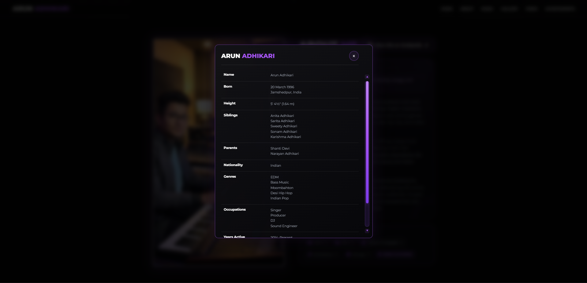
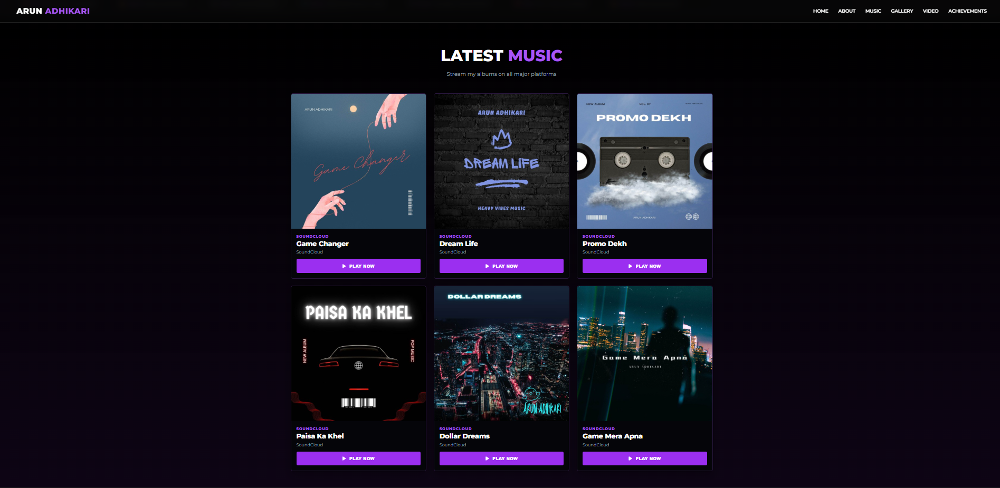
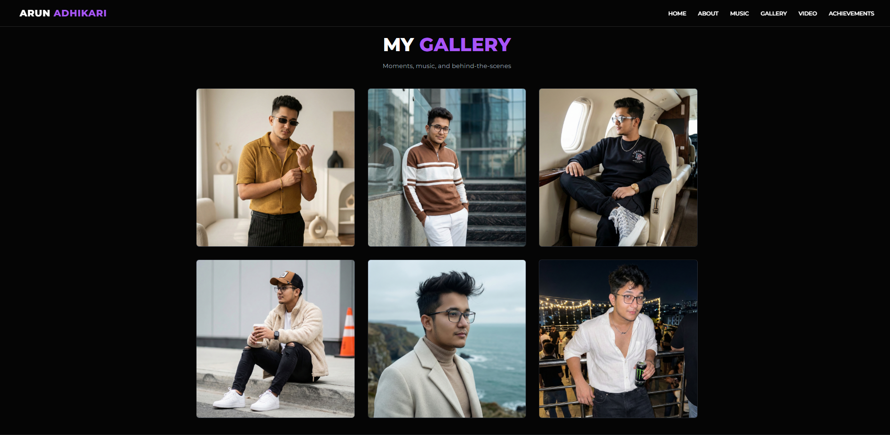
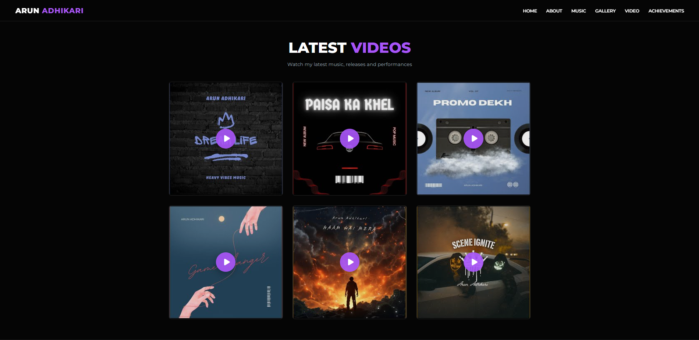
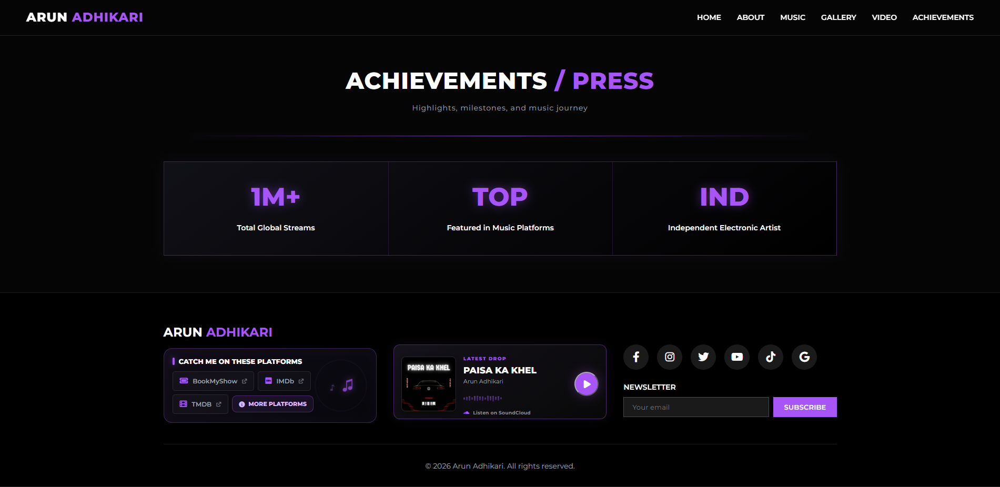

# 🎵 ProducerX 

### Modern Music Artist & Producer Blogger Theme

ProducerX is a modern, dark, responsive and professionally designed Blogger theme created for music artists, producers, rappers, DJs, vocalists, songwriters and independent musicians.

## 💬 Community Discussions

Join the ProducerX community to ask questions, report issues, share ideas, request features, get customization help, and showcase your website.

👉 **[Join ProducerX Discussions](https://github.com/arunadh007/ProducerX/discussions)**

### 🗂️ Discussion Categories

- 📣 [Announcements](https://github.com/arunadh007/ProducerX/discussions/3) — Official ProducerX updates and news
- 💬 [General](https://github.com/arunadh007/ProducerX/discussions/8) — General community discussions and theme customization
- 💡 [Ideas](https://github.com/arunadh007/ProducerX/discussions/6) — Suggest new features and improvements
- 📊 [Polls](https://github.com/arunadh007/ProducerX/discussions/10) — Community polls and feedback
- 🙏 [Q&A](https://github.com/arunadh007/ProducerX/discussions/4) — Questions, answers and support
- 🙌 [Show and Tell](https://github.com/arunadh007/ProducerX/discussions/7) — Share your ProducerX website and customizations

## 📸 Website Preview

### 🏠 Home

### 👤 About

### ℹ️ Artist Information

### 🎵 Music

### 🖼️ Gallery

### 🎬 Video

### 🏆 Achievements & Press

## ✨ Features

- 🎵 Music artist focused design
- 🎧 Music release showcase
- 🎬 Music video section
- 🖼️ Gallery section
- 🏆 Achievements section
- 👤 Artist profile
- 🔗 Social media links
- 🌙 Modern dark interface
- 📱 Fully responsive design
- 🔍 SEO-friendly structure
- ⚡ Clean and lightweight layout

## 🎯 Perfect For

- Music Artists
- Music Producers
- Rappers
- DJs
- Vocalists
- Songwriters
- Independent Musicians
- Music Portfolios

## 🚀 Installation

1. Download `ProducerX.xml`
2. Open your Blogger Dashboard
3. Go to **Theme → Backup → Restore**
4. Upload `ProducerX.xml`
5. Customize the theme according to your artist brand

## 🔧 Customization

You can customize the artist name, biography, music links, social media, videos, gallery, achievements, colors and other website elements.

## 📱 Responsive

ProducerX is designed for desktop, laptop, tablet and mobile devices.

## 🔍 SEO

ProducerX uses a clean and SEO-friendly structure suitable for music artists and independent musicians who want to build a professional online presence.

## 🆕 Version

**ProducerX v1.0**

Initial release of the ProducerX Blogger theme.

## 👨‍🎤 Credits

Created and maintained by **Arun Adhikari**.

## 📄 License

### Creative Commons Attribution-ShareAlike 4.0 International

ProducerX is licensed under the **Creative Commons Attribution-ShareAlike 4.0 International (CC BY-SA 4.0)** license.

You are free to:

- ✅ **Share** — copy and redistribute the theme
- ✅ **Adapt** — remix, transform, and build upon the theme
- ✅ **Commercial Use** — use the theme for commercial projects

### 📌 Conditions

- **Attribution (BY):** You must give appropriate credit to **Arun Adhikari**.
- **ShareAlike (SA):** If you distribute a modified version, it must be shared under the same license.
- **Changes:** You should indicate if modifications were made.

### 🔗 Full License

[View the full CC BY-SA 4.0 License](https://creativecommons.org/licenses/by-sa/4.0/)

**© 2026 Arun Adhikari — ProducerX**

Please check the repository license before modifying, redistributing or publishing modified versions of this theme.

---
